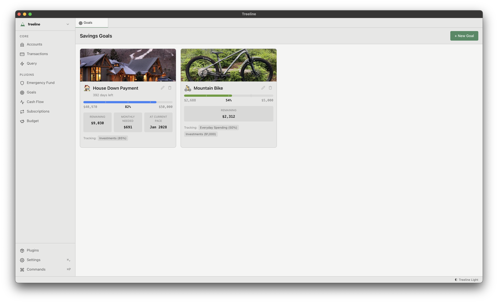
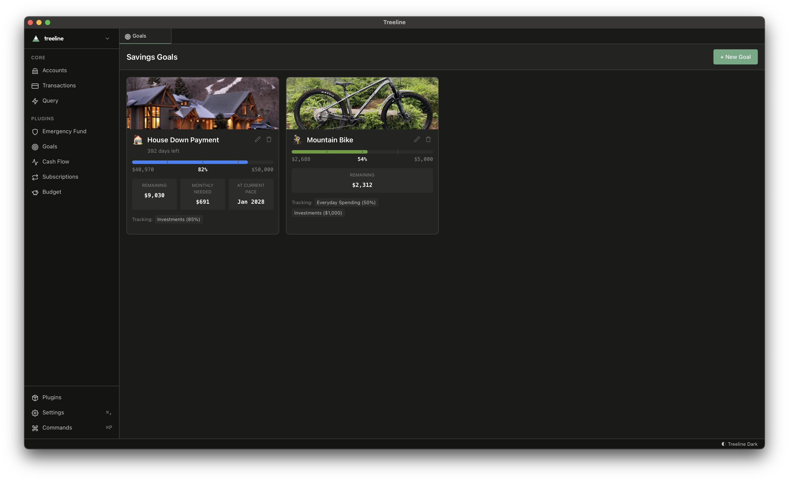
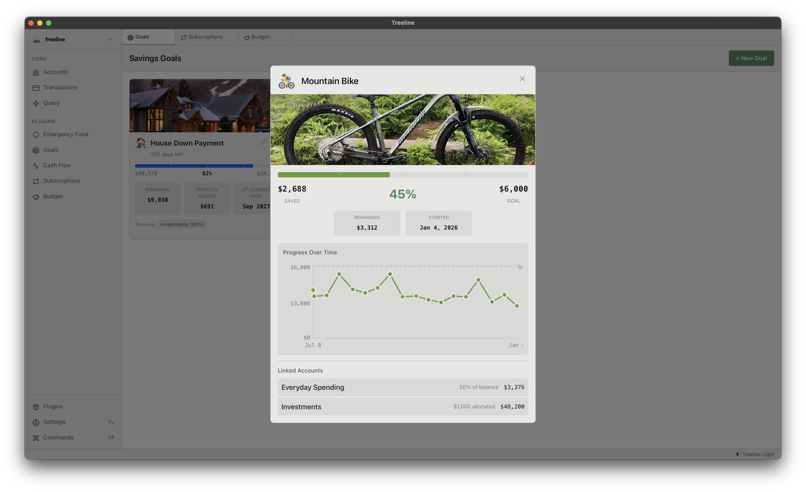
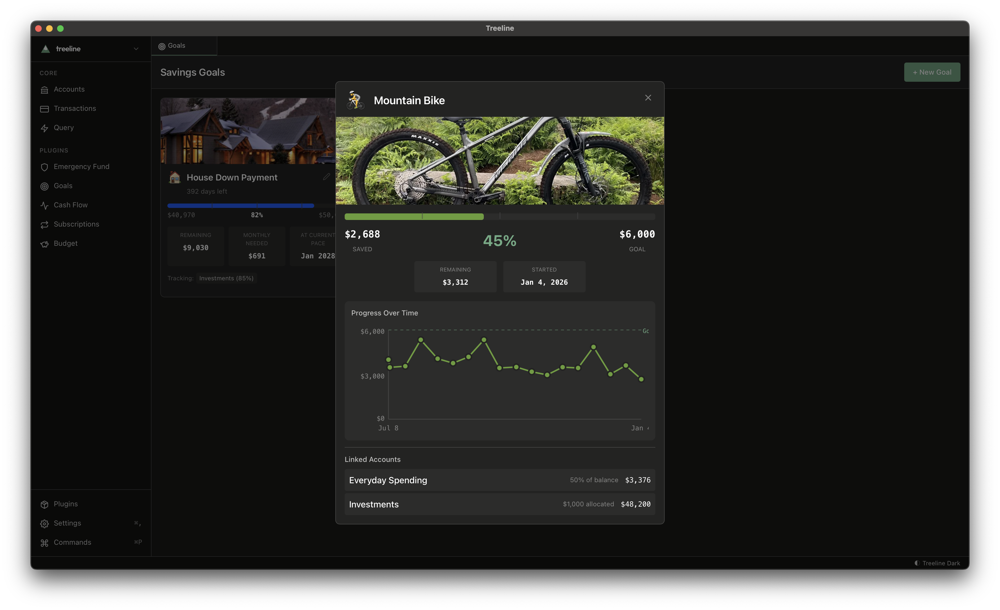

Track savings goals with visual progress, account linking, and historical charts.

## How it works

Create goals for things you're saving for - emergency fund, house down payment, vacation, etc. Link accounts and specify what percentage or fixed amount counts toward each goal. Progress is calculated automatically from your account balances.

## What you'll see

- **Visual progress** - Progress bars with milestone markers at 25%, 50%, 75%
- **Goal images** - Add a photo of what you're saving for
- **Historical charts** - See how your savings have grown over time
- **Pace projections** - Estimated completion date based on your savings rate
- **Celebration** - Confetti when you mark a goal complete

## Getting started

Create your first goal, set a target amount, and optionally link accounts to track progress automatically.
